![Project Logo][social_image]

---

  <a href="#overview">Overview</a> •
  <a href="#presentation">Presentation</a> •
  <a href="#support">Support</a> •

## Overview
These repository contains the presenation and queries of the session given by me in the Data Hour, organized by Analytics Vidhya on 13-Jan-2023 7PM-8PM. You can watch the session on youtube https://www.youtube.com/watch?v=ZZqO5FvUDaw 

## Presentation
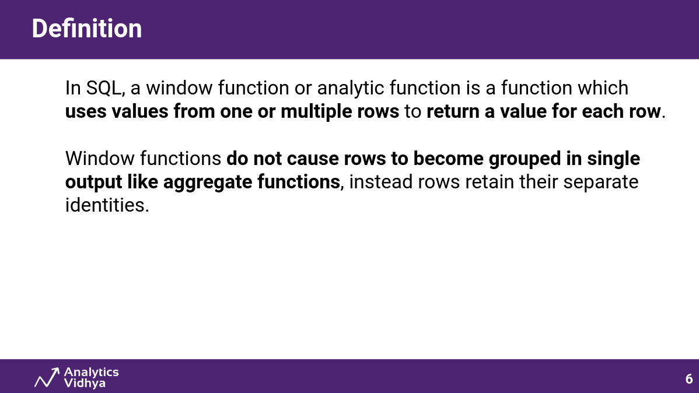
---
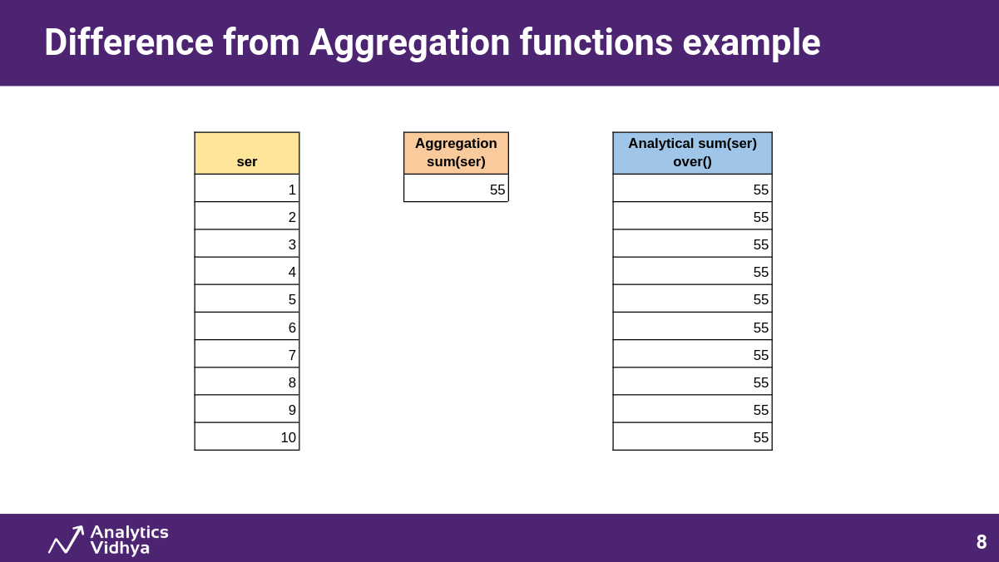
---
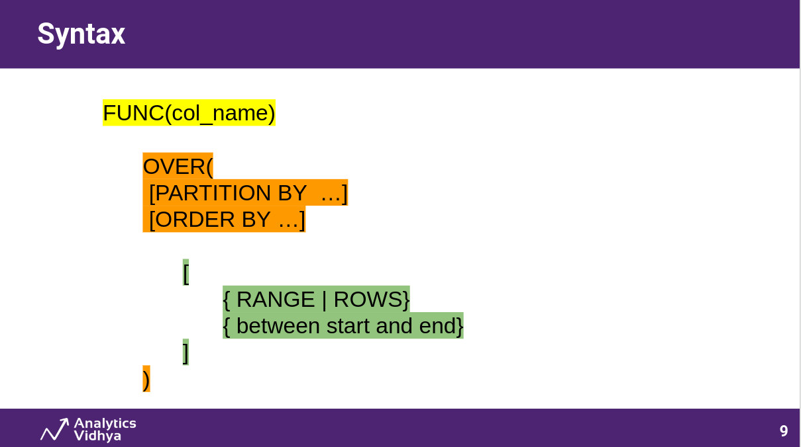
---
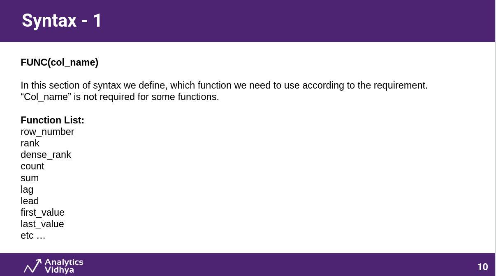
---
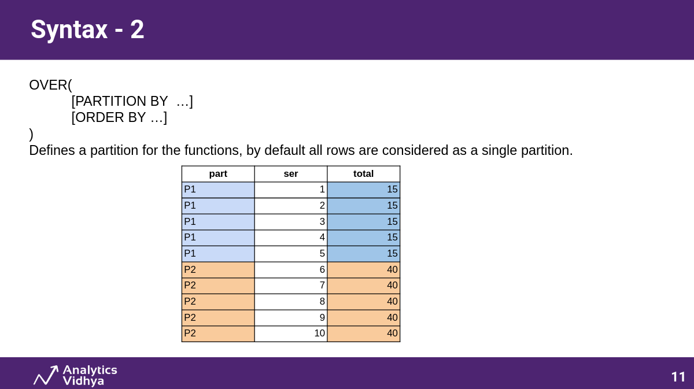
---
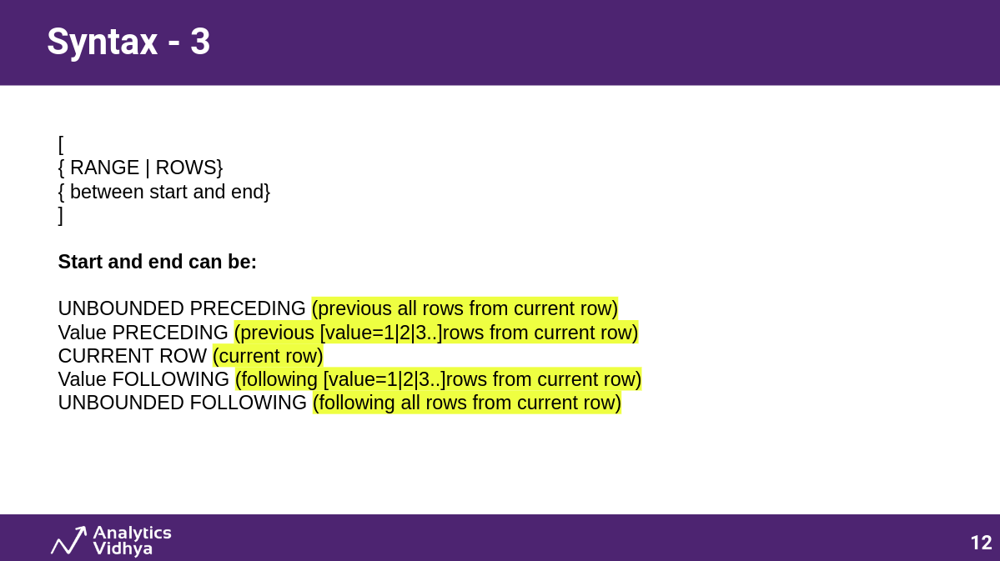
---
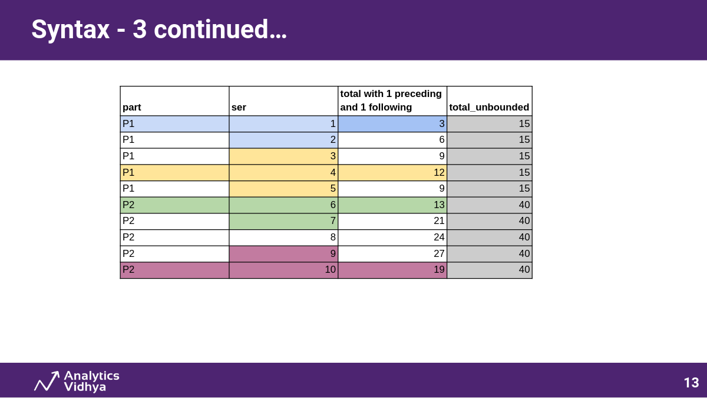
---
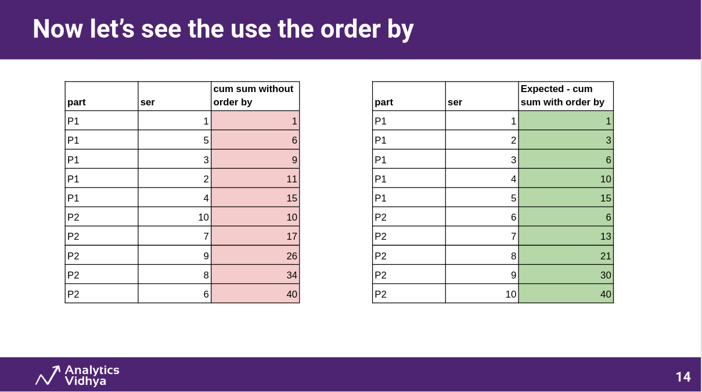
---
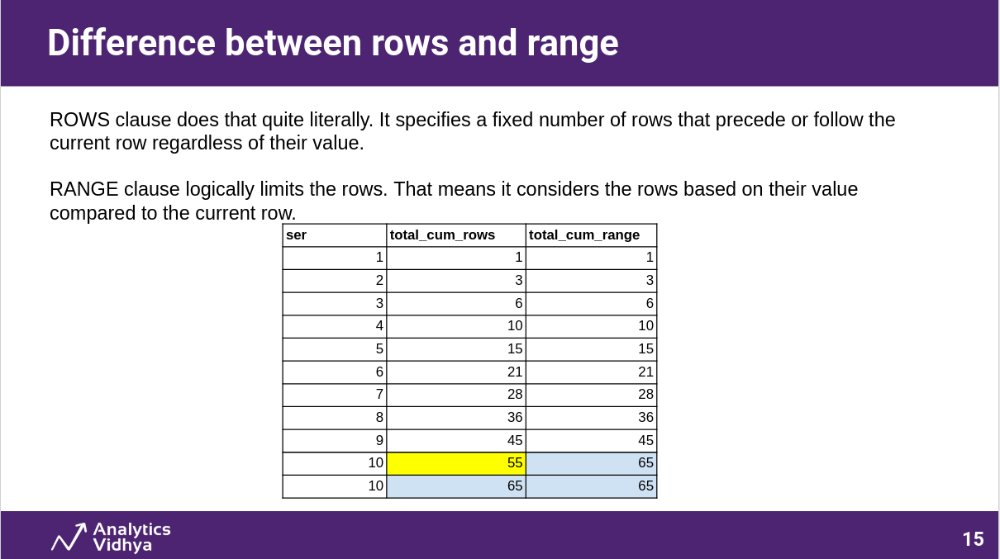
---
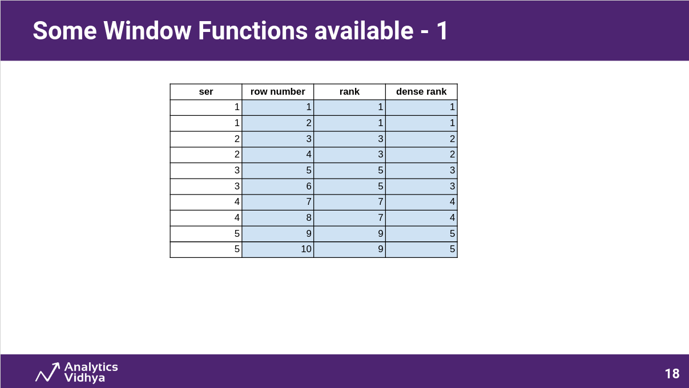
---
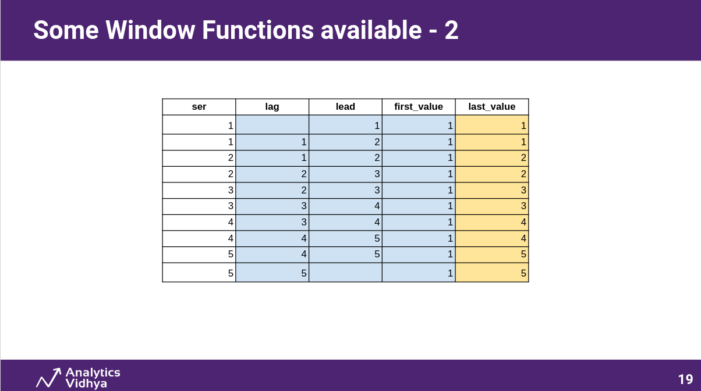
---
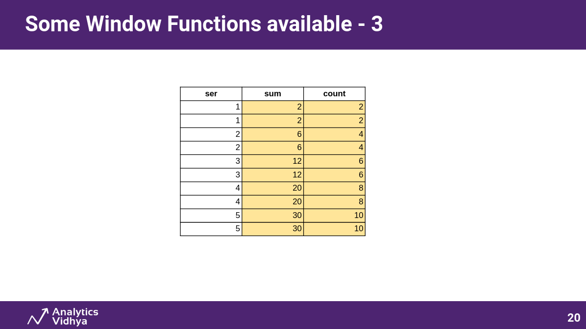
---
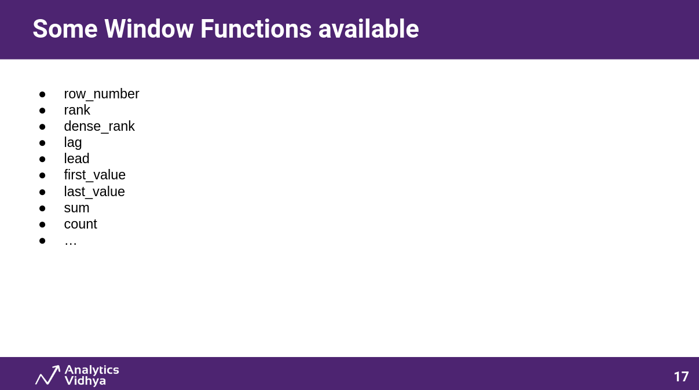
---
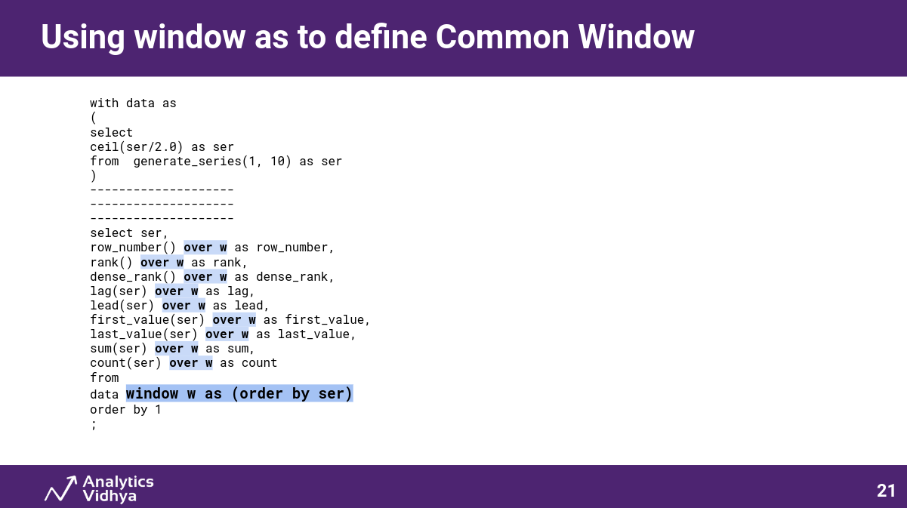
---

## Support

If you have any suggestions or questions then, You can connect me on Linkedin:

[![Linkedin Badge][linkedinbadge]][linkedin]

In case of any issue in the Solution, kindly raise a bug.

Happy Learning :)

<!-- Image Links -->
[social_image]: images/social.png

<!-- Profile Links -->
[linkedin]: https://www.linkedin.com/in/tajinder-55/

<!-- Shields Profile Links -->
[linkedinbadge]: https://img.shields.io/badge/linkedin-blue?logo=linkedin